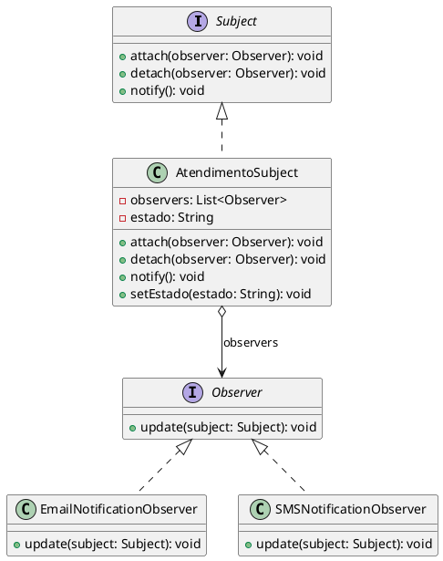
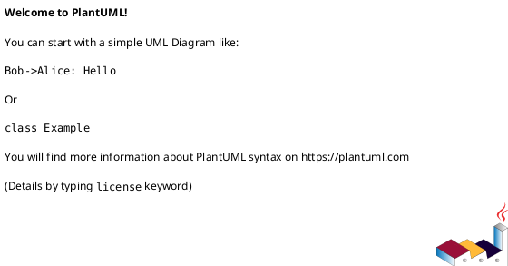

# Guia Completo: Como Implementar um Padrão de Projeto

## 📚 Índice

1. [Processo de Implementação](#processo-de-implementação)
2. [Passo a Passo Detalhado](#passo-a-passo-detalhado)
3. [Exemplo Prático: Padrão Observer](#exemplo-prático-padrão-observer)
4. [Checklist de Conformidade](#checklist-de-conformidade)
5. [Boas Práticas](#boas-práticas)
6. [Erros Comuns](#erros-comuns)

---

## Processo de Implementação

### Visão Geral

```
┌─────────────────┐
│ 1. Entender o   │
│    Problema     │
└────────┬────────┘
         │
         ▼
┌─────────────────┐
│ 2. Escolher o   │
│    Padrão       │
└────────┬────────┘
         │
         ▼
┌─────────────────┐
│ 3. Planejar a   │
│    Estrutura    │
└────────┬────────┘
         │
         ▼
┌─────────────────┐
│ 4. Implementar  │
│    Componentes  │
└────────┬────────┘
         │
         ▼
┌─────────────────┐
│ 5. Integrar ao  │
│    Sistema      │
└────────┬────────┘
         │
         ▼
┌─────────────────┐
│ 6. Testar       │
└────────┬────────┘
         │
         ▼
┌─────────────────┐
│ 7. Documentar   │
└─────────────────┘
```

---

## Passo a Passo Detalhado

### 📝 Passo 1: Entender o Problema

**Objetivo:** Identificar claramente o problema que precisa ser resolvido.

**Atividades:**
1. Analise o código/requisito existente
2. Identifique code smells ou necessidades
3. Documente o problema de forma clara
4. Verifique se realmente precisa de um padrão

**Perguntas a Fazer:**
- ❓ Qual é exatamente o problema?
- ❓ Esse problema é recorrente?
- ❓ Um padrão realmente simplificaria a solução?
- ❓ Não seria over-engineering?

**Exemplo:**
```
PROBLEMA IDENTIFICADO:
"Precisamos notificar múltiplos componentes quando o
status de um atendimento muda, mas atualmente o código
está fortemente acoplado e difícil de estender."

CODE SMELL: Acoplamento forte, mudanças em cascata
NECESSIDADE: Notificação desacoplada de eventos
```

---

### 🎯 Passo 2: Escolher o Padrão Adequado

**Objetivo:** Selecionar o padrão que melhor resolve o problema.

**Categorias de Padrões:**

#### Padrões Criacionais (Como criar objetos)
- **Singleton**: Uma única instância global
- **Factory Method**: Criação delegada às subclasses
- **Abstract Factory**: Famílias de objetos relacionados
- **Builder**: Construção passo a passo
- **Prototype**: Clonagem de objetos

#### Padrões Estruturais (Como organizar classes)
- **Adapter**: Compatibilizar interfaces
- **Bridge**: Separar abstração de implementação
- **Composite**: Estruturas em árvore
- **Decorator**: Adicionar funcionalidades dinamicamente
- **Facade**: Interface simplificada
- **Proxy**: Controle de acesso

#### Padrões Comportamentais (Como objetos colaboram)
- **Observer**: Notificação de mudanças
- **Strategy**: Algoritmos intercambiáveis
- **State**: Comportamento baseado em estado
- **Command**: Encapsular requisições
- **Template Method**: Esqueleto de algoritmo
- **Chain of Responsibility**: Cadeia de handlers

**Decisão:**
```
PADRÃO ESCOLHIDO: Observer

MOTIVO:
- Preciso notificar múltiplos objetos sobre mudanças
- Os observadores podem ser adicionados/removidos dinamicamente
- Baixo acoplamento entre subject e observers
- Padrão clássico para o problema identificado
```

---

### 📐 Passo 3: Planejar a Estrutura

**Objetivo:** Definir classes, interfaces e relacionamentos.

**Atividades:**
1. Crie diagrama UML (PlantUML)
2. Defina interfaces/classes abstratas
3. Identifique classes concretas necessárias
4. Planeje a estrutura de pacotes

**Template de Planejamento:**

```markdown
## Estrutura do Padrão Observer

### Componentes Principais:

1. **Subject (Interface)**
   - attach(observer)
   - detach(observer)
   - notify()

2. **Observer (Interface)**
   - update(subject)

3. **ConcreteSubject**
   - Mantém lista de observers
   - Notifica quando estado muda

4. **ConcreteObservers**
   - Implementam update()
   - Reagem às mudanças

### Estrutura de Pacotes:
```
org.example.padroescomportamentais.observer/
├── Subject.java (interface)
├── Observer.java (interface)
├── AtendimentoSubject.java (concrete)
├── observers/
│   ├── EmailNotificationObserver.java
│   ├── SMSNotificationObserver.java
│   └── LogObserver.java
└── ObserverDemo.java
```
```

**Diagrama UML:**


---

### 💻 Passo 4: Implementar Componentes

**Objetivo:** Codificar o padrão seguindo o planejamento.

**Ordem de Implementação:**

#### 4.1. Criar Interfaces/Classes Abstratas

```java
package org.example.padroescomportamentais.observer;

public interface Observer {
    void update(Subject subject);
}
```

```java
package org.example.padroescomportamentais.observer;

public interface Subject {
    void attach(Observer observer);
    void detach(Observer observer);
    void notifyObservers();
}
```

#### 4.2. Implementar Subject Concreto

```java
package org.example.padroescomportamentais.observer;

import java.util.ArrayList;
import java.util.List;

public class AtendimentoSubject implements Subject {
    private List<Observer> observers = new ArrayList<>();
    private String estado;
    private String descricao;

    @Override
    public void attach(Observer observer) {
        observers.add(observer);
        System.out.println("Observer adicionado: " + observer.getClass().getSimpleName());
    }

    @Override
    public void detach(Observer observer) {
        observers.remove(observer);
        System.out.println("Observer removido: " + observer.getClass().getSimpleName());
    }

    @Override
    public void notifyObservers() {
        System.out.println("Notificando " + observers.size() + " observer(s)...");
        for (Observer observer : observers) {
            observer.update(this);
        }
    }

    public void setEstado(String estado) {
        this.estado = estado;
        this.descricao = "Estado alterado para: " + estado;
        notifyObservers();
    }

    public String getEstado() {
        return estado;
    }

    public String getDescricao() {
        return descricao;
    }
}
```

#### 4.3. Implementar Observers Concretos

```java
package org.example.padroescomportamentais.observer.observers;

import org.example.padroescomportamentais.observer.Observer;
import org.example.padroescomportamentais.observer.Subject;
import org.example.padroescomportamentais.observer.AtendimentoSubject;

public class EmailNotificationObserver implements Observer {
    private String emailDestino;

    public EmailNotificationObserver(String emailDestino) {
        this.emailDestino = emailDestino;
    }

    @Override
    public void update(Subject subject) {
        if (subject instanceof AtendimentoSubject) {
            AtendimentoSubject atendimento = (AtendimentoSubject) subject;
            enviarEmail(atendimento);
        }
    }

    private void enviarEmail(AtendimentoSubject atendimento) {
        System.out.println("┌─────────────────────────────────────┐");
        System.out.println("│ [EMAIL] Notificação Enviada         │");
        System.out.println("├─────────────────────────────────────┤");
        System.out.println("│ Para: " + emailDestino);
        System.out.println("│ Assunto: Atualização de Atendimento");
        System.out.println("│ " + atendimento.getDescricao());
        System.out.println("└─────────────────────────────────────┘");
    }
}
```

```java
package org.example.padroescomportamentais.observer.observers;

import org.example.padroescomportamentais.observer.Observer;
import org.example.padroescomportamentais.observer.Subject;
import org.example.padroescomportamentais.observer.AtendimentoSubject;

public class SMSNotificationObserver implements Observer {
    private String telefone;

    public SMSNotificationObserver(String telefone) {
        this.telefone = telefone;
    }

    @Override
    public void update(Subject subject) {
        if (subject instanceof AtendimentoSubject) {
            AtendimentoSubject atendimento = (AtendimentoSubject) subject;
            enviarSMS(atendimento);
        }
    }

    private void enviarSMS(AtendimentoSubject atendimento) {
        System.out.println("📱 [SMS] Enviado para " + telefone + ": " +
                         atendimento.getDescricao());
    }
}
```

```java
package org.example.padroescomportamentais.observer.observers;

import org.example.padroescomportamentais.observer.Observer;
import org.example.padroescomportamentais.observer.Subject;
import org.example.padroescomportamentais.observer.AtendimentoSubject;
import java.time.LocalDateTime;
import java.time.format.DateTimeFormatter;

public class LogObserver implements Observer {

    @Override
    public void update(Subject subject) {
        if (subject instanceof AtendimentoSubject) {
            AtendimentoSubject atendimento = (AtendimentoSubject) subject;
            registrarLog(atendimento);
        }
    }

    private void registrarLog(AtendimentoSubject atendimento) {
        String timestamp = LocalDateTime.now()
            .format(DateTimeFormatter.ofPattern("yyyy-MM-dd HH:mm:ss"));
        System.out.println("[LOG " + timestamp + "] " + atendimento.getDescricao());
    }
}
```

#### 4.4. Criar Classe de Demonstração

```java
package org.example.padroescomportamentais.observer;

import org.example.padroescomportamentais.observer.observers.*;

public class ObserverDemo {

    public static void main(String[] args) {
        System.out.println("=== DEMONSTRAÇÃO DO PADRÃO OBSERVER ===\n");

        AtendimentoSubject atendimento = new AtendimentoSubject();

        Observer emailObserver = new EmailNotificationObserver("cliente@email.com");
        Observer smsObserver = new SMSNotificationObserver("+55 11 98765-4321");
        Observer logObserver = new LogObserver();

        System.out.println("--- Adicionando Observers ---");
        atendimento.attach(emailObserver);
        atendimento.attach(smsObserver);
        atendimento.attach(logObserver);

        System.out.println("\n--- Mudança de Estado 1 ---");
        atendimento.setEstado("AGENDADO");

        System.out.println("\n--- Mudança de Estado 2 ---");
        atendimento.setEstado("EM ANDAMENTO");

        System.out.println("\n--- Removendo SMS Observer ---");
        atendimento.detach(smsObserver);

        System.out.println("\n--- Mudança de Estado 3 ---");
        atendimento.setEstado("CONCLUÍDO");
    }
}
```

---

### 🔗 Passo 5: Integrar ao Sistema

**Objetivo:** Conectar o padrão ao código existente.

**Exemplo de Integração:**

```java
// Na classe Atendimento existente, adicionar suporte a observers

public abstract class Atendimento {
    // ... atributos existentes ...

    private AtendimentoSubject observerSupport;

    public Atendimento(String id, String cliente, String veiculo, String descricao) {
        // ... código existente ...
        this.observerSupport = new AtendimentoSubject();
    }

    public void addObserver(Observer observer) {
        observerSupport.attach(observer);
    }

    public void removeObserver(Observer observer) {
        observerSupport.detach(observer);
    }

    @Override
    public void setEstado(AtendimentoState estado) {
        this.estado = estado;
        observerSupport.setEstado(estado.getNomeEstado());
    }
}
```

---

### 🧪 Passo 6: Testar

**Objetivo:** Validar que o padrão funciona corretamente.

#### 6.1. Criar Testes Unitários

```java
package org.example.padroescomportamentais.observer;

import org.example.padroescomportamentais.observer.observers.*;
import org.junit.jupiter.api.BeforeEach;
import org.junit.jupiter.api.Test;
import static org.junit.jupiter.api.Assertions.*;

class ObserverTest {

    private AtendimentoSubject subject;
    private TestObserver observer1;
    private TestObserver observer2;

    @BeforeEach
    void setUp() {
        subject = new AtendimentoSubject();
        observer1 = new TestObserver();
        observer2 = new TestObserver();
    }

    @Test
    void deveNotificarObserversQuandoEstadoMudar() {
        subject.attach(observer1);
        subject.attach(observer2);

        subject.setEstado("AGENDADO");

        assertEquals(1, observer1.getUpdateCount());
        assertEquals(1, observer2.getUpdateCount());
    }

    @Test
    void deveAdicionarObserver() {
        subject.attach(observer1);
        subject.setEstado("AGENDADO");

        assertEquals(1, observer1.getUpdateCount());
    }

    @Test
    void deveRemoverObserver() {
        subject.attach(observer1);
        subject.detach(observer1);
        subject.setEstado("AGENDADO");

        assertEquals(0, observer1.getUpdateCount());
    }

    @Test
    void deveNotificarApenasObserversAtivos() {
        subject.attach(observer1);
        subject.attach(observer2);
        subject.detach(observer1);

        subject.setEstado("AGENDADO");

        assertEquals(0, observer1.getUpdateCount());
        assertEquals(1, observer2.getUpdateCount());
    }

    @Test
    void devePermitirMultiplasNotificacoes() {
        subject.attach(observer1);

        subject.setEstado("AGENDADO");
        subject.setEstado("EM ANDAMENTO");
        subject.setEstado("CONCLUÍDO");

        assertEquals(3, observer1.getUpdateCount());
    }

    private static class TestObserver implements Observer {
        private int updateCount = 0;

        @Override
        public void update(Subject subject) {
            updateCount++;
        }

        public int getUpdateCount() {
            return updateCount;
        }
    }
}
```

#### 6.2. Executar Testes

```bash
mvn test -Dtest=ObserverTest
```

---

### 📝 Passo 7: Documentar

**Objetivo:** Criar documentação clara e completa.

#### 7.1. Atualizar README/Documentação Principal

```markdown
## Padrão Observer - Notificação de Eventos

### Propósito
Define uma dependência um-para-muitos entre objetos, onde quando um objeto
muda de estado, todos os seus dependentes são notificados automaticamente.

### Quando Usar
- Quando uma mudança em um objeto requer mudanças em outros
- Quando um objeto deve notificar outros sem conhecê-los
- Quando você precisa de baixo acoplamento entre objetos

### Estrutura
- **Subject**: Define interface para anexar/remover observers
- **Observer**: Define interface de atualização
- **ConcreteSubject**: Mantém estado e notifica observers
- **ConcreteObserver**: Implementa atualização

### Exemplo de Uso
```java
AtendimentoSubject atendimento = new AtendimentoSubject();
atendimento.attach(new EmailNotificationObserver("cliente@email.com"));
atendimento.attach(new SMSNotificationObserver("+55 11 98765-4321"));

atendimento.setEstado("AGENDADO"); // Notifica todos os observers
```

### Benefícios
✅ Baixo acoplamento entre subject e observers
✅ Suporte para broadcast de comunicação
✅ Observers podem ser adicionados/removidos em tempo de execução

### Desvantagens
⚠️ Observers não sabem sobre outros observers
⚠️ Pode causar atualizações em cascata
⚠️ Ordem de notificação pode ser importante
```

#### 7.2. Criar Diagrama UML



#### 7.3. Adicionar Comentários no Código

```java
/**
 * Padrão Observer - Subject
 *
 * Interface que define operações para gerenciar observers.
 * Permite adicionar, remover e notificar observers sobre mudanças de estado.
 */
public interface Subject {
    void attach(Observer observer);
    void detach(Observer observer);
    void notifyObservers();
}
```

---

## Checklist de Conformidade

Use este checklist para garantir que o padrão foi implementado corretamente:

### ✅ Checklist Geral

- [ ] Problema claramente identificado
- [ ] Padrão apropriado escolhido
- [ ] Estrutura planejada (diagrama UML)
- [ ] Interfaces/abstrações definidas
- [ ] Classes concretas implementadas
- [ ] Integrado ao sistema existente
- [ ] Testes unitários criados
- [ ] Testes passando (100%)
- [ ] Documentação completa
- [ ] Código revisado

### ✅ Checklist por Tipo de Padrão

#### Padrões Criacionais
- [ ] Criação de objetos encapsulada
- [ ] Cliente desacoplado de classes concretas
- [ ] Facilita adicionar novos tipos

#### Padrões Estruturais
- [ ] Composição preferida sobre herança
- [ ] Interfaces bem definidas
- [ ] Flexibilidade para mudanças

#### Padrões Comportamentais
- [ ] Responsabilidades bem distribuídas
- [ ] Baixo acoplamento entre objetos
- [ ] Comunicação clara entre objetos

### ✅ Princípios SOLID

- [ ] **SRP**: Cada classe tem uma única responsabilidade
- [ ] **OCP**: Aberto para extensão, fechado para modificação
- [ ] **LSP**: Subtipos substituem tipos base corretamente
- [ ] **ISP**: Interfaces coesas e específicas
- [ ] **DIP**: Dependência de abstrações, não de concretizações

---

## Boas Práticas

### 1. Nomenclatura Clara
```java
// ✅ BOM
public class EmailNotificationObserver implements Observer

// ❌ RUIM
public class ENO implements Obs
```

### 2. Responsabilidade Única
```java
// ✅ BOM - Classe focada
public class LogObserver implements Observer {
    public void update(Subject subject) {
        log(subject.getEstado());
    }
}

// ❌ RUIM - Classe faz muitas coisas
public class MegaObserver implements Observer {
    public void update(Subject subject) {
        sendEmail();
        sendSMS();
        logToDatabase();
        updateCache();
        notifySlack();
    }
}
```

### 3. Injeção de Dependências
```java
// ✅ BOM
public class EmailObserver implements Observer {
    private final EmailService emailService;

    public EmailObserver(EmailService emailService) {
        this.emailService = emailService;
    }
}

// ❌ RUIM
public class EmailObserver implements Observer {
    private EmailService emailService = new EmailService();
}
```

### 4. Testes Abrangentes
```java
// ✅ Teste comportamentos importantes
@Test
void deveNotificarTodosObserversRegistrados()

@Test
void naoDeveNotificarObserversRemovidos()

@Test
void deveManterOrdemDeNotificacao()
```

### 5. Documentação Útil
```java
/**
 * Notifica cliente por email sobre mudanças no atendimento.
 * Envia email assíncrono usando o serviço configurado.
 */
public class EmailNotificationObserver implements Observer
```

---

## Erros Comuns

### ❌ Erro 1: Escolher Padrão Errado

**Problema:**
```java
// Usando Observer quando deveria usar Strategy
public class CalculadoraPreco {
    private List<Observer> observers = new ArrayList<>();
    // Observer não é a ferramenta certa para trocar algoritmos!
}
```

**Solução:**
```java
// Strategy é mais apropriado
public class CalculadoraPreco {
    private CalculoStrategy strategy;
}
```

### ❌ Erro 2: Over-Engineering

**Problema:**
```java
// Padrão desnecessário para código simples
public interface AnimalFactory {
    Animal createAnimal();
}
// Para criar apenas um tipo de animal!
```

**Solução:**
```java
// Simplicidade quando apropriado
Animal cachorro = new Cachorro();
```

### ❌ Erro 3: Acoplamento Forte

**Problema:**
```java
public class ConcreteObserver implements Observer {
    public void update(Subject s) {
        ConcreteSubject cs = (ConcreteSubject) s; // ❌ Cast arriscado
        cs.getSpecificMethod(); // ❌ Acoplamento com classe concreta
    }
}
```

**Solução:**
```java
public interface Subject {
    String getEstado(); // ✅ Método na interface
}

public class ConcreteObserver implements Observer {
    public void update(Subject s) {
        s.getEstado(); // ✅ Usa interface
    }
}
```

### ❌ Erro 4: Esquecer de Testar

**Problema:**
- Implementar padrão sem testes
- Assumir que funciona

**Solução:**
- TDD (Test-Driven Development)
- Cobertura de casos importantes
- Testes de integração

### ❌ Erro 5: Documentação Inadequada

**Problema:**
```java
// Sem documentação
public class X implements Y {
    public void z(A a) {
        // código complexo sem explicação
    }
}
```

**Solução:**
```java
/**
 * Implementa padrão Observer para notificação de eventos.
 *
 * @param subject O subject que mudou de estado
 */
public class EmailObserver implements Observer {
    @Override
    public void update(Subject subject) {
        // Implementação documentada
    }
}
```

---

## Template para Novos Padrões

```markdown
## Padrão: [NOME DO PADRÃO]

### 1. Problema Identificado
[Descreva o problema]

### 2. Solução Proposta
[Por que este padrão resolve o problema]

### 3. Estrutura Planejada
[Diagrama UML]

### 4. Componentes
- **Interface/Abstração 1**: [Descrição]
- **Classe Concreta 1**: [Descrição]

### 5. Implementação
[Código principal]

### 6. Testes
[Estratégia de testes]

### 7. Integração
[Como integrar ao sistema]

### 8. Benefícios
- ✅ Benefício 1
- ✅ Benefício 2

### 9. Trade-offs
- ⚠️ Desvantagem 1
- ⚠️ Desvantagem 2
```

---

## Conclusão

Implementar um padrão de projeto é um processo sistemático que requer:

1. **Compreensão** do problema
2. **Seleção** cuidadosa do padrão
3. **Planejamento** detalhado
4. **Implementação** incremental
5. **Testes** rigorosos
6. **Documentação** clara

Siga este guia e você terá implementações de padrões de alta qualidade,
manuteníveis e alinhadas com as melhores práticas de engenharia de software.

**Lembre-se:** Padrões são ferramentas, não objetivos. Use-os quando
agregarem valor real ao projeto!
