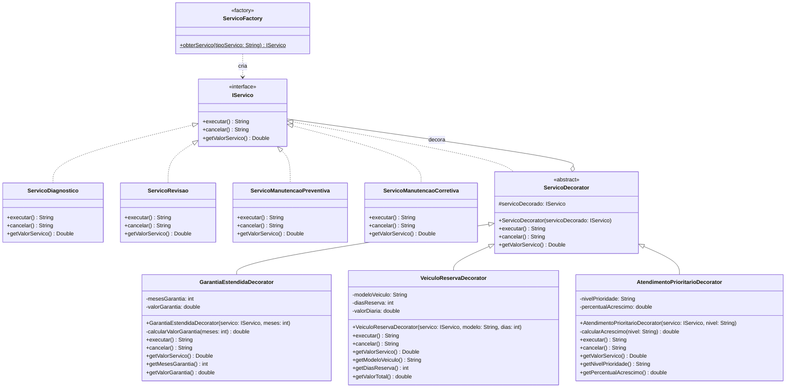

# Diagrama de Classes - Padrão Decorator

## Visão Geral
O padrão Decorator permite adicionar funcionalidades extras aos serviços de forma dinâmica, sem modificar a estrutura original das classes.

## Diagrama de Classes



## Estrutura do Padrão

### Component (IServico)
Interface que define as operações básicas que podem ser decoradas.

### Concrete Components (ServicoDiagnostico, ServicoRevisao, etc.)
Implementações concretas da interface IServico, criadas pelo Factory Method.

### Decorator (ServicoDecorator)
Classe abstrata que implementa IServico e mantém uma referência para um objeto IServico.
Delega todas as chamadas para o objeto decorado.

### Concrete Decorators
- **GarantiaEstendidaDecorator**: Adiciona garantia estendida (12, 24 ou 36 meses)
- **VeiculoReservaDecorator**: Disponibiliza veículo reserva durante o serviço
- **AtendimentoPrioritarioDecorator**: Adiciona prioridade ao atendimento (ALTA, MEDIA, BAIXA)

## Exemplo de Uso

```java
// Criar serviço base com Factory
IServico servico = ServicoFactory.obterServico("Diagnostico");

// Adicionar garantia
servico = new GarantiaEstendidaDecorator(servico, 24);

// Adicionar veículo reserva
servico = new VeiculoReservaDecorator(servico, "Honda City", 3);

// Adicionar prioridade
servico = new AtendimentoPrioritarioDecorator(servico, "ALTA");

// Executar serviço decorado
System.out.println(servico.executar());
System.out.printf("Valor: R$ %.2f\n", servico.getValorServico());
```

## Cálculo de Valores

### Garantia Estendida
- 12 meses: R$ 100,00
- 24 meses: R$ 180,00
- 36 meses: R$ 250,00

### Veículo Reserva
- R$ 80,00 por dia

### Atendimento Prioritário
- ALTA: +30% sobre o valor total atual
- MEDIA: +20% sobre o valor total atual
- BAIXA: +10% sobre o valor total atual

## Vantagens do Padrão

1. **Flexibilidade**: Adiciona funcionalidades em tempo de execução
2. **Composição**: Combina múltiplos decoradores
3. **Open/Closed Principle**: Adiciona comportamento sem modificar código existente
4. **Single Responsibility**: Cada decorator tem uma responsabilidade específica
5. **Compatibilidade**: Funciona perfeitamente com Factory Method existente
