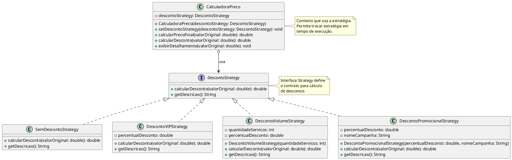

# Padrão Strategy - Diagrama UML

## Estrutura do Padrão



## Benefícios do Padrão Strategy

- **Algoritmos intercambiáveis**: Facilita trocar o algoritmo de desconto em tempo de execução
- **Open/Closed Principle**: Novos tipos de desconto podem ser adicionados sem modificar código existente
- **Single Responsibility**: Cada estratégia tem uma única responsabilidade
- **Elimina condicionais**: Remove if/else ou switch para escolher comportamento

## Exemplo de Uso

```java
// Cliente Regular (sem desconto)
CalculadoraPreco calculadora = new CalculadoraPreco(new SemDescontoStrategy());
double precoFinal = calculadora.calcularPrecoFinal(1000.0);

// Cliente VIP (15% desconto)
calculadora.setDescontoStrategy(new DescontoVIPStrategy());
precoFinal = calculadora.calcularPrecoFinal(1000.0);

// Desconto por Volume (10% para > 3 serviços)
calculadora.setDescontoStrategy(new DescontoVolumeStrategy(5));
precoFinal = calculadora.calcularPrecoFinal(1000.0);

// Promoção Especial (20% desconto)
calculadora.setDescontoStrategy(new DescontoPromocionalStrategy(20.0, "Black Friday"));
precoFinal = calculadora.calcularPrecoFinal(1000.0);
```
